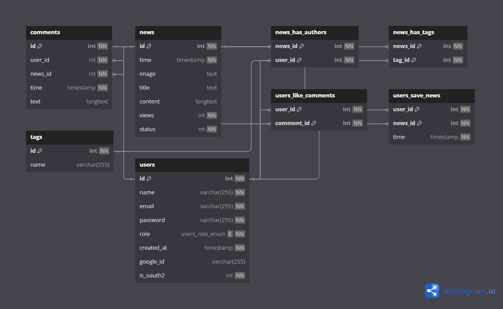
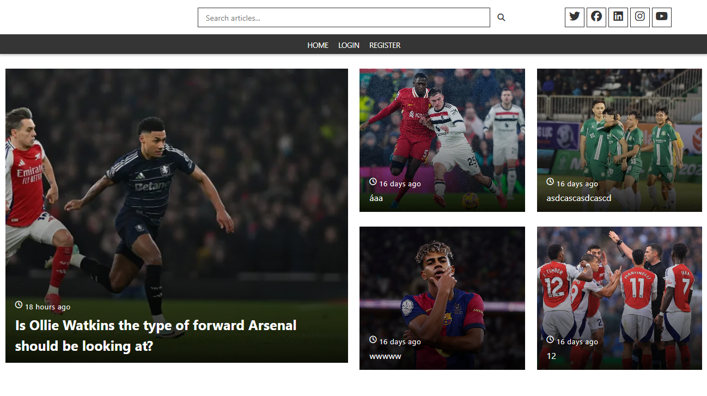
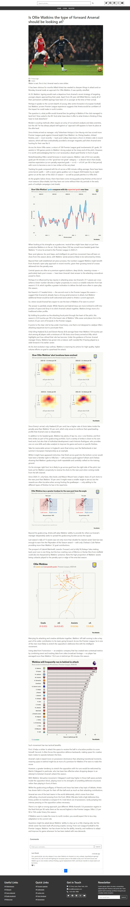
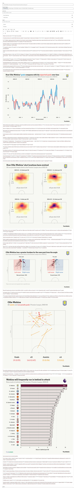
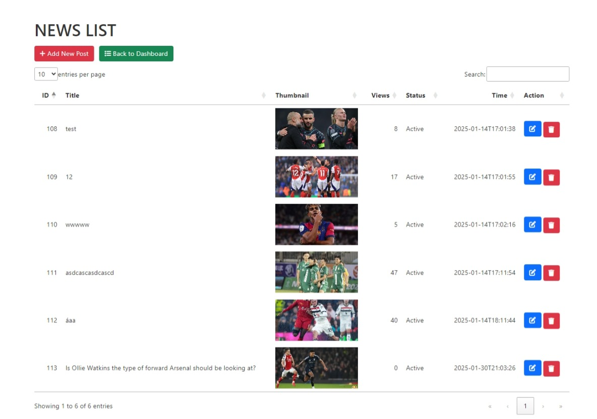

# Java Spring News Management

A web-based news management application built using **Java Spring Boot**. This project allows users to create, manage, and view news articles with features like user authentication, role-based access, and more.

## Features

### **Level 1 - Essential** 
_This requirement is critical to the project's success. The project cannot proceed without this feature._
- **User Authentication**: Supports login and registration.  
- **Discretionary Access Control**:
  - Admin: Manage all news, users.
  - Writers: Create and edit their own articles.
  - Viewers: Read articles.  
- **News Management**:
  - Create, edit, and delete news.
  - Support for categorization and tagging.  
- **Rich Text Editing**: Integrated with CKEditor5 for creating and editing content.  
- **Responsive Design**: Optimized for both desktop and mobile devices.  
- **Google OAuth2**: Login using Google accounts.
- **User Interaction**:
  - Comment on articles: Readers can add, edit, or delete their comments.
  - Real-time viewing comments: Users can read comments in real-time with Websocket.
  - Like articles: Users can like their favorite articles.  

### **Level 2 - Future**
_This requirement is beyond the scope of this project and has been included here for potential future releases._
- **User Interaction**:
  - Save news: Save the post if user want to read later.

## Technologies Used

- **Backend**:
  - Java Spring Boot
  - Spring Security (with OAuth2 integration)
  - JPA/Hibernate (MySQL database)
- **Frontend**:
  - Thymeleaf
  - Bootstrap
- **Other**:
  - CKEditor5 (Rich text editor)
  - WebSocket (Handling comments in real-time)

## Project Structure

```
src/
└── main/
    ├── java/com/GoalLineNews/
    │   ├── auth        #authentication and authorization setup
    │   ├── controller  #handle HTTP requests
    │   ├── dto         #data transfer objects for transferring data
    │   ├── entity      #JPA entities representing database tables
    │   ├── repository  #data access layer (Spring Data JPA)
    │   └── service     #business logic and service layer 
    ├── resources/
    │   ├── static      #static resources (CSS, JS, images)
    │   ├── templates   #Thymeleaf templates for frontend views
    │   └── application.properties
    └── upload          #directory for storing uploaded files
```

## Database



## Project View

### Home  Screen


### Read Article

### Post new article

### Admin Data Table


